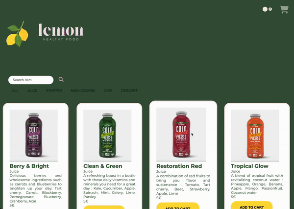

# Dark Kitchen
- `Repository:` [dark-kitchen](https://github.com/leilaZ1111/dark-kitchen)
- `Vercel deployment:` [Visit Now](https://dark-kitchen-one.vercel.app/)
  
## Description
Two months into our training, our team was given the challenge to build a single-page website for online food delivery. The goal was to create a visually appealing platform that provides a delightful experience for users. 

In this collaborative project, we were to display a list of dishes using some sort of card templates, categorizable dishes through filters, alight/dark mode switch, and a responsive website.

## ⚙️ Technologies
   
  

## Sneak Peeks into our Dark Kitchen

  

## Learning objectives of this project:
The goal of this challenge was to delve into various aspects of the Document Object Model (DOM) and construct the webpage dynamically using JavaScript, rather than relying on hardcoded HTML files provided.

This project allowed us, as beginners in our second month of coding, to put into practice the foundational javaScript concepts we've learned so far. We got hands-on experience with variables, conditions, loops, arrays, objects, and functions. It was a great way to solidify our understanding of these core programming elements while working on a real-world project.

Although we wished we could have taken it further, we had limited time, and this was only our second collaborative project. In this regard, it was an invaluable opportunity to learn about collaboration and using Git for version control in a team setting, and we had a lot of fun!

  

  

## Authors

**Camila Fernandes Assunção**

- [GitHub Profile](https://github.com/CamilaFAssuncao "Camila Fernandes Assunção")
- [Linkedin](https://www.linkedin.com/in/camilafassuncao/)

**Safae Khanchouf**
- [GitHub Profile](https://github.com/iammmei)
- [Linkedin](https://www.linkedin.com/in/safae-khanchouf/)

**Leila Zitouni**

- [GitHub Profile](https://github.com/leilaZ1111 "Leila Zitouni")
- [Linkedin](www.linkedin.com/in/leila-zitouni)

